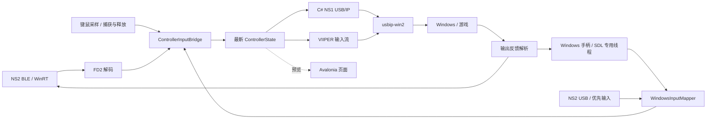

# 架构与数据流

适用版本：**1.0.1**；核对日期：2026-09-27。当前是一个 Windows 桌面应用工程，采用 Avalonia MVVM；目录用于划分职责，并非多个独立服务工程。主工程见 [ControllerForwardingTool.csproj](../ControllerForwardingTool/ControllerForwardingTool.csproj)。

## 1. 模块职责

| 模块/入口 | 当前责任 |
| --- | --- |
| [Program.cs](../ControllerForwardingTool/Program.cs)、[App.axaml.cs](../ControllerForwardingTool/App.axaml.cs) | 单实例检查、日志、运行目录、Avalonia 生命周期、托盘和窗口唤醒 |
| [MainViewModel.cs](../ControllerForwardingTool/ViewModels/MainViewModel.cs) 及其 partial 文件 | 连接状态、页面快照、输入选择、线路草稿、映射、校准和软件设置编排 |
| [Ns2BleTransport.cs](../ControllerForwardingTool/Bluetooth/Ns2BleTransport.cs) | WinRT 扫描与 GATT 会话、初始化、有效首帧、参数协商、注册与串行震动写入 |
| [Fd2Decoder.cs](../ControllerForwardingTool/Protocol/Ns2/Fd2Decoder.cs) | NS2 输入解码；电量由同目录 `Ns2Battery` 解析 |
| [GamepadMonitor.cs](../ControllerForwardingTool/Input/GamepadMonitor.cs) / [SdlGamepadService.cs](../ControllerForwardingTool/Input/SdlGamepadService.cs) | 独立线程持有 SDL，发现设备、读取输入/传感器及执行震动 |
| [KeyboardMouseMonitor.cs](../ControllerForwardingTool/Input/KeyboardMouseMonitor.cs) / [KeyboardMouseMapper.cs](../ControllerForwardingTool/Input/KeyboardMouseMapper.cs) | 键鼠采样、F8 捕获、失焦释放和模拟摇杆 / 体感 |
| [HybridInputMapper.cs](../ControllerForwardingTool/Input/HybridInputMapper.cs) / [MappingDraftPreview.cs](../ControllerForwardingTool/Input/MappingDraftPreview.cs) | 多源按钮与体感合并、当前草稿预览 |
| [BridgeInput.cs](../ControllerForwardingTool/Input/BridgeInput.cs) | 输入归一化、源切换隔离、已保存映射与死区处理、虚拟输入回环过滤 |
| [ControllerState.cs](../ControllerForwardingTool/Core/ControllerState.cs) | NS2、Windows、键鼠及混合输入与各输出共用的不可变状态 |
| [VirtualControllerSession.cs](../ControllerForwardingTool/VirtualDevice/VirtualControllerSession.cs) | 一个后端、一个 USB/IP 挂载、发送/反馈任务与停止清理 |
| [VirtualProfiles.cs](../ControllerForwardingTool/VirtualDevice/VirtualProfiles.cs) | 五种输出身份、VIIPER 输入编码与反馈尺寸 |
| [UsbIpPrototypeServer.cs](../ControllerForwardingTool/VirtualDevice/UsbIpPrototypeServer.cs) / [UsbIpNs1Device.cs](../ControllerForwardingTool/VirtualDevice/UsbIpNs1Device.cs) | 内置 NS1 USB/IP 传输、描述符、HID 请求、子命令和输入报告 |
| [BridgeOptions.cs](../ControllerForwardingTool/VirtualDevice/BridgeOptions.cs) / [OutputRouteOptions.cs](../ControllerForwardingTool/VirtualDevice/OutputRouteOptions.cs) | 配置归一化、迁移、线路选择与文件保存 |

## 2. 输入、线程与状态

`ControllerState` 使用 Nintendo 按键命名，四个摇杆轴范围为 0–4095，中位 2048，Y 轴向上为正；包括 IMU、运动时间戳、接收时间及可空的模拟扳机值。中立状态清除按钮和运动数据，摇杆回中。Windows 源先按物理面键位置转换，再把 SDL 向下为正的 Y 轴翻转；Xbox/PS 输出保留 0–255 模拟扳机，Nintendo 数字扳机按行程大于 0.5 判定。

`ControllerInputBridge` 用锁串行化源切换与发布，避免旧源的迟到回调覆盖新源。NS2 USB、BLE、Windows 标准手柄及纯键鼠都在统一坐标下应用按键映射一次；兼容字段名仍为 `Ns2Buttons`。NS2 输入线路优先选中的 USB，失效先归零再允许 BLE 接续。BLE 读取按地址保存的摇杆校准；Windows / USB 路径只应用死区，之后应用实体摇杆映射。

`KeyboardMouseMonitor` 负责捕获与释放；纯键鼠由 `KeyboardMapping` 处理默认键、自定义覆盖和方向绑定。实体模式由 `HybridInputMapper` 仅合并显式键鼠按钮、保留实体轴并选择体感来源。关闭补充立即清空补充状态；实体状态超过 250 ms 时整个混合输出归零，键鼠采样不会延长实体输入寿命。`Comparison.Source` 保留原始输入，输出使用已应用的配置；映射页通过 `MappingDraftPreview` 单独计算草稿效果。

SDL 的所有本机调用在 `GamepadMonitor` 专用线程中执行，主循环等待约 8 ms，约每秒刷新设备；UI 只读快照。输入桥通过 `FrameUpdated` 接收 Windows 状态，通过 BLE 回调接收 FD2，输出不依赖约 33 ms 的界面刷新。SDL 可合并物理事件，因此快照循环、事件时间戳统计与硬件原始报告率是不同指标。

本应用创建的虚拟设备通过 `NS2PROWIN11-` 序列号前缀及挂载期间新增的匹配设备 ID 记录归属。挂载前已存在的同 VID/PID 手柄仍可作为输入。SDL ID 属于当前枚举会话；运行中源断开不会自动换到另一只手柄。

`Ns2UsbRecovery` 在 HID 枚举可见但 SDL 无已打开 NS2 时，约每 3 秒在 SDL 所在线程切换 Switch 2 驱动提示以重试打开；禁用访问、注册占用或已有打开设备时不重试。USB 注册同样经该线程暂停 SDL，再由 libusb 独占管理接口；流程和验证边界见 [USB 注册与连接](29_NS2_USB_REGISTRATION.md)。

## 3. BLE 连接与注册

`BleAdvertisementFilter`、`BleDeviceHistory`、`BleAutoConnectPolicy` 和 `GattDiscoveryRetry` 分别负责候选识别、历史/遗忘状态、连接资格与服务发现重试。当前自动连接依赖新鲜广播，不再以历史“轮询所有记住地址”的方案作为操作保证。

候选广播需在 2 秒内；失败后要求新的广播，通常还需 2 秒冷却。普通唤醒失败后出现新的 SYNC 配对广播可提前重试。广播目标主机和 `IsConnectable` 用于诊断，不作为通用拦截条件。遗忘的设备不能普通自动回连，新鲜 SYNC 配对允许重新接入。

连接流程有 60 秒总限时，发现并订阅 GATT 后执行初始化，等待有效 FD2 首帧最多 6 秒。请求 Windows `ThroughputOptimized` BLE 连接参数，失败时沿用系统参数；实际间隔与帧率通过状态和日志观察，不能由请求本身推断性能。

`RegisterHostOnSync` 默认关闭。开启且连接开始时存在 5 秒内的 SYNC 配对广播时，在有效输入后执行 `Ns2PairingProtocol` 的四阶段注册：地址交换、随机材料交换、挑战验证、提交。核对命令/回复结构、地址与 AES 挑战，最终确认后才保存主机地址及时间，不保存密钥。未确认的最终提交不能被解释为手柄一定未写入。实现参考记录见[主机注册](../ControllerForwardingTool/docs/23_NS2_HOST_REGISTRATION.md)。

## 4. 输出后端与节奏

`VirtualControllerSession` 对启动、停止加生命周期锁。同一实例只维护一个当前输出会话。启动先清理旧会话，创建中立状态，再启动后端并通过 `UsbIpClient` 挂载到 Windows。

| 路径 | 协议与生命周期 |
| --- | --- |
| NS1 Pro | 进程内 C# USB/IP 服务，`Ns1ReportEncoder` 生成 64 字节 `0x30` 报告，处理初始化、子命令、SPI 合成校准和 IMU 开关；不启动 VIIPER |
| NS2 / Xbox / PS5 / Edge | 校验随附 `viiper-haptic.exe` 的固定 SHA-256，创建后台进程、API 总线和目标设备，核对类型及 VID/PID，打开输入/反馈流 |

VIIPER 输入帧为 NS2 28 字节、Xbox 20 字节、PS5/Edge 33 字节；反馈分别为 34、2、388、6 字节。它们是应用与 VIIPER 之间的格式，不应直接等同于实体手柄 USB HID 报告。NS1 的 `FeedbackSize = 0` 只表示不使用该固定长度 VIIPER 通道，NS1 的 OUT 报告仍有震动处理。

服务只绑定 `127.0.0.1`。端口为 0 时自动选择；非 NS1 模式使用 API 和 USB/IP 两个不同端口。NS1 只使用 USB/IP 端口。停止时只卸载本会话记录的挂载端口并终止自身后端。

`PushHz = 0` 跟随源状态更新，通过合并唤醒信号发送最新状态，不积压旧帧；`-1` 使用本项目输出参考频率（NS1 125 Hz，其余 250 Hz）；66/125/250 为固定频率。固定频率可以重复最新状态，不会制造新的物理采样。

源状态超过 250 ms 未更新时输出中立状态。源跟随模式随后低频发送中立保活。NS1 的挂起 IN 请求与控制/OUT 请求独立处理，UNLINK 可取消等待，避免等待输入阻塞初始化和反馈。传输断开触发故障处理与会话停止。

## 5. 震动反馈

`Pro2OutputPacketMapper` 转换 Xbox、NS1、NS2、Edge 等反馈，普通 PS5 模式通过 `DualSenseHapticRumbleScheduler` 处理普通/音频触觉数据。输入为 Windows 手柄时，`WindowsRumble` 将其转换为 SDL 马达强度；不能把这种回传当作任意源手柄都具备 HD 触觉。

BLE 使用单个约 12 ms 的写入循环和 `BleRumblePlayback`：普通马达与 NS1 强度包标记为持续状态，重复编码到收到替换或停止；HD/音频数据作为流处理，不循环播放旧波形，500 ms 无流数据触发停止保护。每个 BLE 连接单独持有播放状态。

识别振动是独立的 25% / 250 ms 限时脉冲，BLE 通过 `PlaybackDuration` 停止；后续游戏包替换脉冲时清除其计时。NS2 USB 和 Windows 实体反馈经 SDL，BLE 经当前连接；纯键鼠主输入不将游戏反馈发给其他实体设备。

会话停止先发零强度，禁止关闭期间的迟到反馈，在所有反馈生产者退出后再次发零强度。详细修复背景见[持续振动说明](28_TESTER_DISCOVERY_AND_SUSTAINED_RUMBLE.md)。

## 6. 测试页、配置和桌面生命周期

`MainViewModel.TesterCards` 的上方列表包含当前已连接 BLE 和 SDL 枚举设备，也包含本应用的虚拟输出。未知归属的 Windows 设备标为“系统手柄”，不能仅据该标签判断物理/虚拟。下方五种输出卡片始终是已保存映射的参考，不随枚举切换为实际接收，也不会启动后端。

映射入口要求当前输出正在运行且 Windows 已枚举对应的本应用设备；入口失效时取消录入并返回虚拟手柄页。弹窗确认只改变草稿，映射页可预览未保存配置；保存才用于输出。键鼠测试仅在选中当前真实枚举的虚拟设备时启用，页面读取 SDL 回读数据。

`OutputRoutes` 按输出身份划分线路，编辑草稿与运行快照分离；用户数据、自启、托盘和单实例流程见[配置与生命周期](03_CONFIGURATION_AND_LIFECYCLE.md)。关于页从 `AppIdentity` 读取统一版本、构建时间、框架和源码地址，通过 Avalonia Launcher 打开链接，失败时显示可手动访问的地址。
